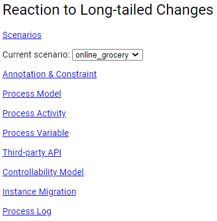
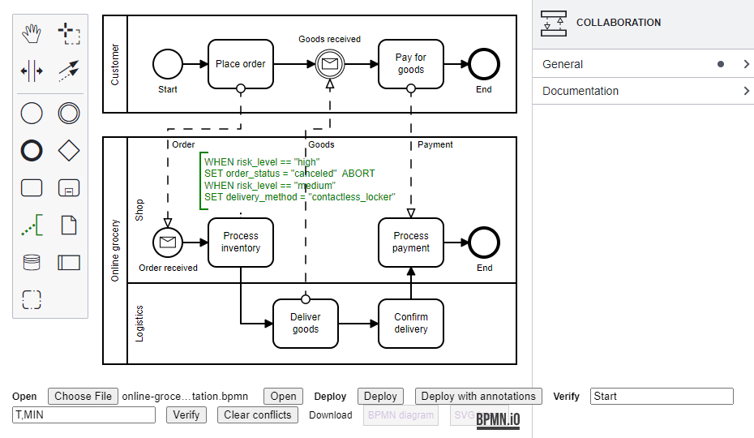
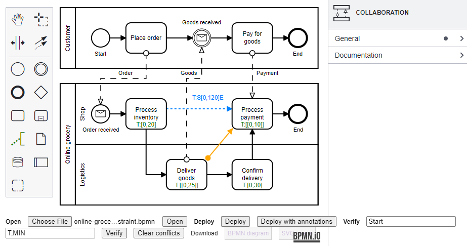
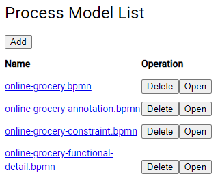

# Reaction to Long-tailed Changes

## Introduction

This  project supports the reaction to long-tailed changes of business processes. This project adopts the separation of concerns (SoC) principle.

A front-line person can

- annotate a business process model with domain-specific language (DSL), in order to intervene in the behavior of the business process;

- bind third-party APIs, in order to query information that is helpful in reacting to long-tailed changes.

A back-end person can

- specify functional and non-functional (temporal) constraints on a business process model, in order to make the reaction to long-tailed changes comply with business regulations;

- specify the value ranges of the process variables in a business process model.

Our tool can

- convert a process model  annotated with DSL into an ordinary process model, so that an existing process engine (e.g., Camunda) can execute it;

- verify whether a process model still meets functional and non-functional constraints after the reaction to long-tailed changes.

## Requirements

This project is developed using Java 11, Maven 3.6, Node.js 14.16, and Npm 6.14.

Optional requirements:

- Functional constraints are verified using NuSMV 2.6.0. Install NuSMV and add it to PATH.

- Controllability is checked using PRISM 4.7. Install PRISM, and register the installation path in `compiler-backend\src\main\resources\application.properties`.

## Run

First, run subproject `engine-backend` with command `mvn spring-boot:run`. It is a process engine powered by Camunda. The process engine can be accessed at http://localhost:8082/ . The default user is admin/admin.

Then, run subproject `compiler-backend` with command `mvn spring-boot:run`. It is our tool to convert process models and verify functional and non-functional constraints.

Next, run subproject `dsl-frontend` with command `npm run start` (on the first run, install packages with command `npm install`). It is our tool to annotate process models, bind third-party APIs, specify constraints, and specify value ranges of process variables. The tool can be accessed at http://localhost:8093/ .

This is the homepage of our tool:

### Process ID

`Process ID` determines the business process application to react to long-tailed changes. We have two example applications: `online_grocery` and `lng_logistics`.

### Annotation

`Annotation` is for a front-line person to annotate a process model:

Usage:

- Open a process model. Click `Choose File` to choose a .bpmn file and click `Open` to open the process model. An example is `process-example/online-grocery-annotation.bpmn`.

- Add a text annotation. Choose an activity and click  to add a text annotation.

- Write a DSL code. Use buttons and drop-down menus to write a DSL code.

- Deploy the process model. Click `Deploy with annotation` to deploy the annotated process model.

### Constraint

`Constraint` is for a back-end person to specify functional and non-functional constraints on a process model:

Usage:

- Open a process model. Click `Choose File` to choose a .bpmn file and click `Open` to open the process model. An example is `process-example/online-grocery-constraint.bpmn`.

- Specify a functional constraint. Draw a link between two activities and set the relation in `Declarative` in the property panel.

- Specify a non-functional constraint. Choose an activity and set the duration in `Temporal` in the property panel. Draw a link between two activities and set the constraint in `Temporal` in the property panel.

- Verify the constraints. Set the start node name and click `Verify`.

### Process Model

`Process Model` is to store process models:

Click `Open` to open the process model in `Annotation` or `Constraint`.

### Process Variable

`Process Variable` is for a back-end person to specify the value ranges of the process variables in a process model:

### Third-party API

`Third-party API` is for a front-line person to bind third-party APIs:

### Instance Migration

`Instance Migration` is to migrate old process instances to the new process model:

### Process Log

`Process Log` is to view the log of process execution in the process engine:

## Case Study

A case study of an e-commerce scenario is available in directory `case-study`.

## Publications

- Jingwei Zhu, Jun Peng, Liang Zhang, Hong-Linh Truong. Improving Business Process Resilience to Long-tailed Business Events via Low-code. 2022 IEEE International Conference on Web Services (ICWS 2022). IEEE, 2022: 343-348.

- Jingwei Zhu. On Balancing Flexibility and Compliance of Business Processes: Functional Constraints Modeling and Verification. 20th International Conference on Service-Oriented Computing (ICSOC 2022) Workshops. Springer, 2023: 327-333.

- Jun Peng, Jingwei Zhu, Liang Zhang. Generalizing STNU to Model Non-functional Constraints for Business Processes. 2022 CCF International Conference on Service Science (ICSS 2022). IEEE, 2022: 104-111.

- Jingwei Zhu, Jun Peng, Liang Zhang, Hong-Linh Truong. Balancing Flexibility and Compliance in Response to Long-Tailed Business Process Changes. Available at SSRN 4460901, 2023.
