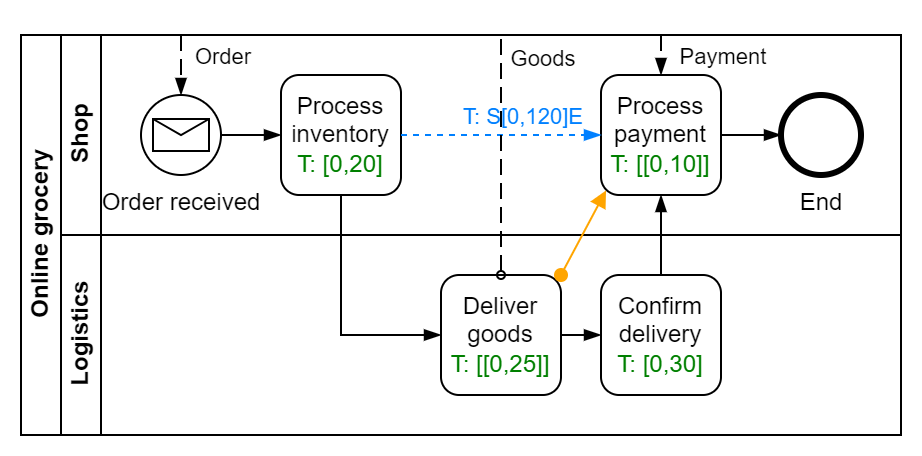
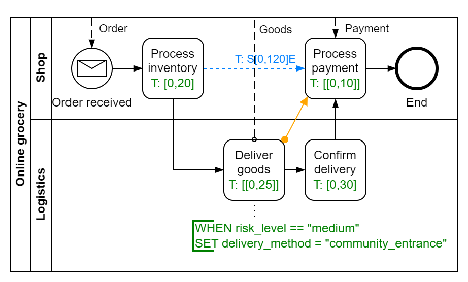
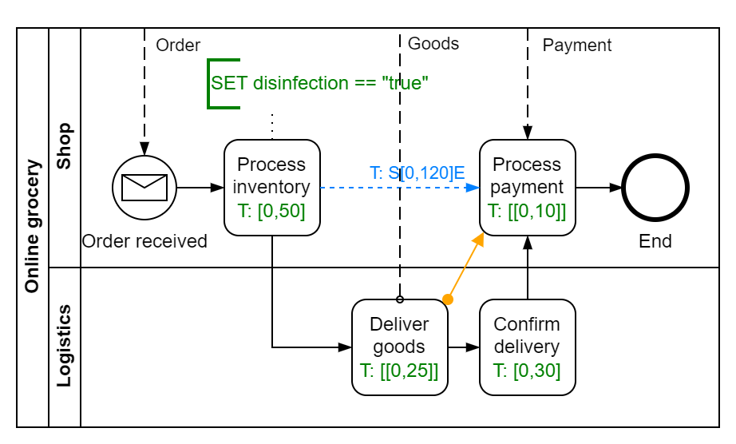
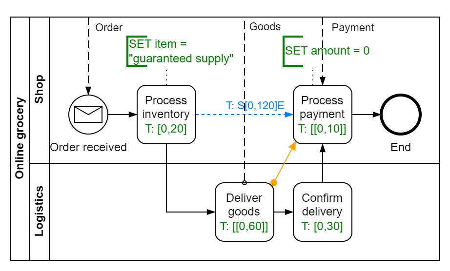

# Case Study

## CAICAI

CAICAI is an online grocery chain store that provides non-staple foods for residents in many cities in China.  Every local unit operates as an independent franchise according to the business process model:

## Epidemic in Shanghai from March 1, 2022

A wave of epidemic breaks out in Shanghai from March 1, 2022. With the evoluation of the epidemic situation, the epidemic counter policy of the municipal government is also changing rapidly. Policy adjustments are long-tailed business events that disrupt the business of CAICAI. With our framework, CAICAI can quickly react to long-tailed changes induced by these events.

### 2022-03-01

Event: Infection cases are reported and medium-risk areas appear. See http://english.shanghai.gov.cn/nw48081/20220301/785a9d077b74417d9bef5972f352293b.html and http://english.shanghai.gov.cn/nw48081/20220302/850532212c3f4664a42de5ee2f3ca311.html .

Reaction: Deliver goods to community entrances in medium-risk areas. Risk level of area can be queried from an API.

### 2022-03-08

Event: "Dawn of victory over COVID-19 pandemic has appeared", said doctor Wenhong ZHANG, head of Shanghai's COVID-19 treatment team and director of the National Center for Infectious Diseases. See http://english.shanghai.gov.cn/nw48081/20220308/c7085d34cd2642bb9ecdd082d546a87e.html .

Reaction: No further countermeasures are needed.

### 2022-03-15

Event: Disinfection measures have been enforced. Delivery companies in Shanghai stepping up disinfections. "Parcels are 100 percent disinfected at least twice," said Fang Rongcheng, head of ZTO Express Shanghai management center. See http://english.shanghai.gov.cn/nw48081/20220315/e7e710ce44024b77bbb8e301d58dabc9.html .

Reaction: Disinfect goods before issue. Extend issuing time.

### 2022-03-16

Event: There is no need for a citywide lockdown in Shanghai at present, despite the surging number of COVID-19 cases reported recently, according to a senior local government official. See http://english.shanghai.gov.cn/nw48081/20220318/8cf5108ef933478881f1e0265ceb91d9.html .

Reaction: No further countermeasures are needed.

### 2022-03-26

Event: Shanghai pandemic turning point is round the corner. "Though the inflection point of the pandemic is yet to appear, Shanghai now has the conditions to embrace an inflection point," Doctor Wenhong ZHANG insisted. See http://english.shanghai.gov.cn/nw48081/20220326/bb64c4da2fb94c36b0de90f947abfa60.html .

Reaction: No further countermeasures are needed.

### 2022-03-28

Event: A full lockdown will be imposed on Shanghai's Pudong and Puxi in turn for a new round of citywide nucleic acid testing. See http://english.shanghai.gov.cn/nw48081/20220328/15b553dda71f46878fe6d43e162ca1b7.html and http://english.shanghai.gov.cn/nw48081/20220328/5a183b3e3b9040aca2f159918ace8e95.html .

Reaction: Adjust delivery of goods in Pudong and Puxi in turn.

### 2022-03-31

Event: All highways leading to Pudong are closed until 5 am on April 1, and all tollgates of the expressways in Puxi and their adjacent areas will be shut down from 3 am on April 1 to 3 am on April 5. See http://english.shanghai.gov.cn/nw48081/20220330/57f491839c3a4e02a463670cc2312b9f.html and http://english.shanghai.gov.cn/nw48574/20220331/396eafaf1ea34e2d8d4cb17b6e1c0b09.html .

Reaction: Help government for guaranteed supply and extend the delivery time limit.

### 2022-04-06

Event: Group purchases pick up steam around city. Meituan Maicai's bulk purchasing is offering next-day delivery in parts of Songjiang, Baoshan, Xuhui, and Putuo districts. See http://english.shanghai.gov.cn/nw48081/20220406/91aa8a414e7c4d7e869a092a48aefcea.html .

Reaction: Support group purchases only. Issuing starts from 30 pieces.

### 2022-04-08

Event: Lockdown will be lifted for a group of markets and warehouses in the city in order to ensure life supplies for residents, Shanghai Vice Mayor Chen Tong said. See http://english.shanghai.gov.cn/nw48081/20220408/a3d3e20d39ad47dfbcddd4ce697b7785.html .

Reaction: The situation is getting better. No further countermeasures are needed.

### 2022-04-11

Event: Authority acts to ensure regulation of group buying. Shanghai's market watchdog will strengthen supervision and management of group buying with combined measures. See http://english.shanghai.gov.cn/nw48081/20220411/1feb319382e944969d435a478d4a2ef5.html .

Reaction: Ban group purchases. 

### 2022-04-11

Event: Logistics centers ensure adequate supplies of goods. Shanghai will open "as many as possible" markets or logistic centers to ensure food and daily supplies to citizens during the lockdown, the head of the city's commerce commission said. See http://english.shanghai.gov.cn/nw48081/20220411/b206efd8ba7844bdab2529459f51b1fb.html .

Reaction: The situation is getting better. No further countermeasures are needed.

### 2022-04-12

Event: The city will adopt 3-level control measures after phased lockdown. Based on the results of previous screenings and risky levels, local areas are classified as either "locked down," "controlled" or "precautionary.". See http://english.shanghai.gov.cn/nw48081/20220411/4bf9a1382b554c2d94dc56d0457a1f2d.html and http://english.shanghai.gov.cn/nw48081/20220413/895105752b4a49198b5c6f8567701d86.html .

Reaction: Adjust delivery of goods according to area type. Area type can be queried from an API.

