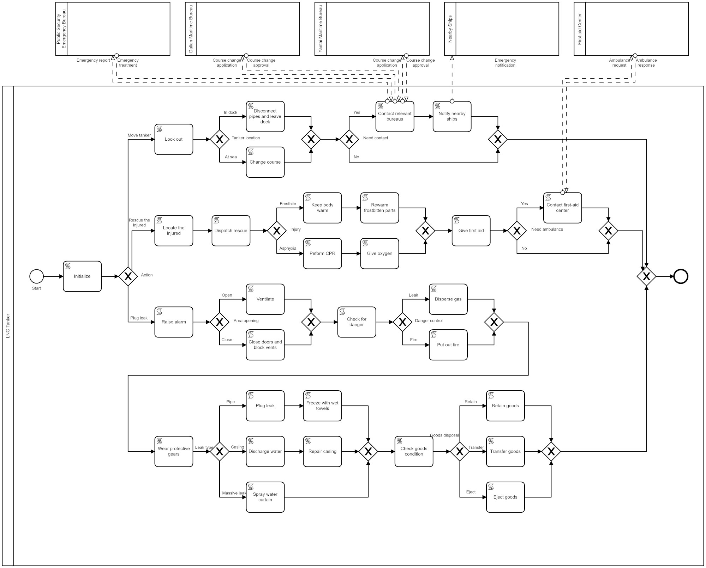

# Experiment

We conduct an experiment to evaluate the efficiency of DSL-annotation. We ask font-line persons to adapt business processes through both direct modification and DSL-annotation, and collect time consumption, correctness, and usability rating.

## Scenario 1: LNG Logistics

BoYuan, which is a liquefied natural gas (LNG) logistics company, operates LNG tankers at sea. Yantai-Dalian route, which is one of the company's operating routes, is accident-prone because it crosses other waterways. LNG is a kind of dangerous goods. If an accident happens to an LNG tanker, causing LNG to leak, it will be a disaster. To plan for LNG leakage, BoYuan developed an emergency response process:

LTCs include:

- LTC1. When the process is running at *Ventilate*, LNG suddenly injures people. The process needs to be adapted to rescuing the injured.

- LTC2. When the process is running at *Check for danger*, ships are found nearby. The process needs to be adapted to notifying nearby ships.

- LTC3. When the process is running at *Plug leak*, LNG suddenly catches fire. The process needs to be adapted to putting out fire.

- LTC4. Before ejecting goods, the LNG tanker is on a public waterway. The process needs to be adapted to changing course.

The comparison of time consumption, correctness, and usability rating between direct modification and DSL-annotation is:

| Process adaptation method | Average time consumption (seconds) | Average correctness | Average usability rating (10-point scale) |
| ---- | ---- | ---- | ---- |
| Direct modification | 143.4 | 81.3% | 5.9 |
| DSL-annotation | 59.4 | 93.8% | 9.3 |

## Scenario 2: Project Management

## Scenario 3: Travel Agency

## Scenario 4: Insurance Claim

## Scenario 5: Paper Review

## Scenario 6: Emergency Call

## Overall Result
