# Experiment

We conduct an experiment to evaluate the efficiency of DSL-annotation. We ask font-line persons to adapt business processes through both direct modification and DSL-annotation, and collect time consumption, correctness, and usability rating.

## Scenario 1: LNG Logistics

BoYuan, which is a liquefied natural gas (LNG) logistics company, operates LNG tankers at sea. Yantai-Dalian route, which is one of the company's operating routes, is accident-prone because it crosses other waterways. LNG is a kind of dangerous goods. If an accident happens to an LNG tanker, causing LNG to leak, it will be a disaster. To plan for LNG leakage, BoYuan developed an emergency response process:

LTCs include:

- LTC1. When the process is running at *Ventilate*, LNG suddenly injures people. The process needs to be adapted to rescuing the injured.

- LTC2. When the process is running at *Check for danger*, ships are found nearby. The process needs to be adapted to notifying nearby ships.

- LTC3. When the process is running at *Plug leak*, LNG suddenly catches fire. The process needs to be adapted to putting out fire.

- LTC4. Before ejecting goods, the LNG tanker is on a public waterway. The process needs to be adapted to changing course.

For each LTC, the comparison of adaptation between direct modification and DSL-annotation is:

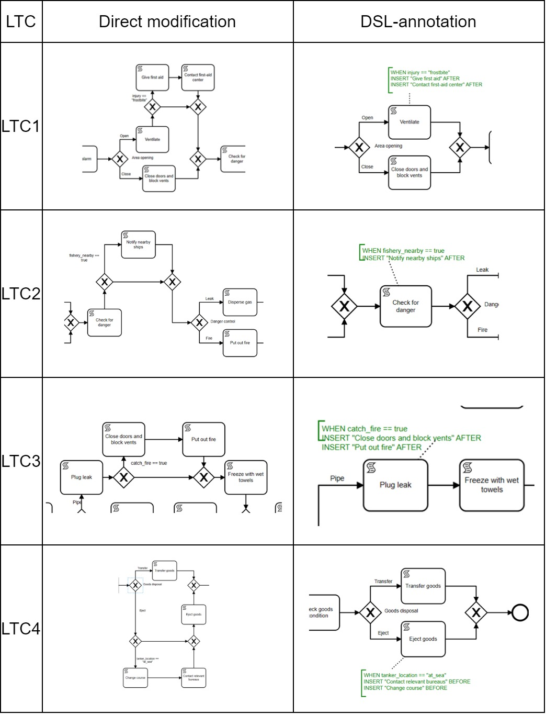

For each LTC, the comparison of time consumption (seconds) between direct modification and DSL-annotation is:

| LTC | Time consumption of direct modification | Time consumption of DSL-annotation |
| ---- | ---- | ---- |
| LTC1 | 160.8 | 76.5 |
| LTC2 | 100.0 | 49.0 |
| LTC3 | 168.5 | 63.3 |
| LTC4 | 144.5 | 48.8 |
| Average | 143.5 | 59.4 |

The overall comparison of time consumption, correctness, and usability rating between direct modification and DSL-annotation is:

| Process adaptation method | Time consumption (seconds) | Correctness | Usability rating (10-point scale) |
| ---- | ---- | ---- | ---- |
| Direct modification | 143.5 | 81.3% | 5.9 |
| DSL-annotation | 59.4 | 93.8% | 9.3 |

(This scenario undergoes four times of experiments and takes the average results, while the following scenarios undergo only one time of experimet.)

## Scenario 2: Travel Agency

The business process of a travel agency is:

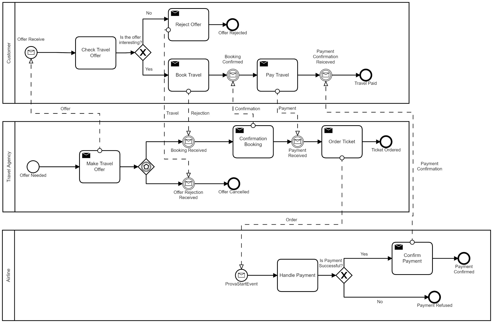

LTCs include:

- LTC1. When the customer is applying for a travel offer, the country's travel policies change, affecting the application. The process needs to be adapted to inform the customer of relevant policies.

- LTC2. When the customer is applying for a travel offer, due to the country's policies, it is not possible to travel to certain areas. The process needs to be adapted to modify the destination.

For each LTC, the comparison of adaptation between direct modification and DSL-annotation is:

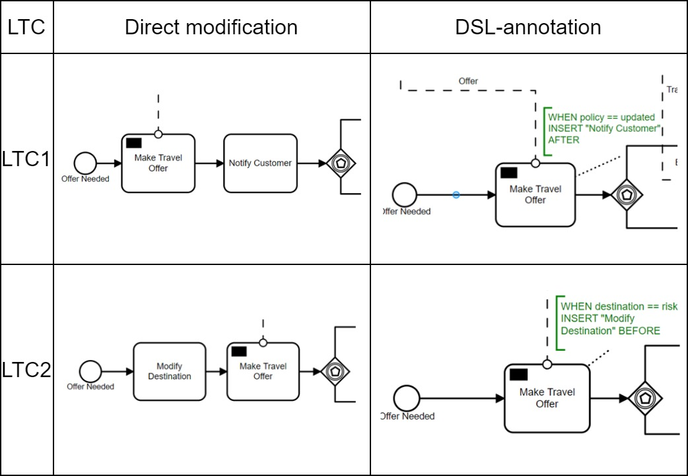

For each LTC, the comparison of time consumption (seconds) between direct modification and DSL-annotation is:

| LTC | Time consumption of direct modification | Time consumption of DSL-annotation |
| ---- | ---- | ---- |
| LTC1 | 132 | 35 |
| LTC2 | 144 | 40 |
| Average | 138.0 | 37.5 |

The overall comparison of time consumption, correctness, and usability rating between direct modification and DSL-annotation is:

| Process adaptation method | Time consumption (seconds) | Correctness | Usability rating (10-point scale) |
| ---- | ---- | ---- | ---- |
| Direct modification | 138.0 | 100.0% | 6.0 |
| DSL-annotation | 37.5 | 100.0% | 9.0 |

## Scenario 3: Insurance Claim

The business process of an insurance platform is:

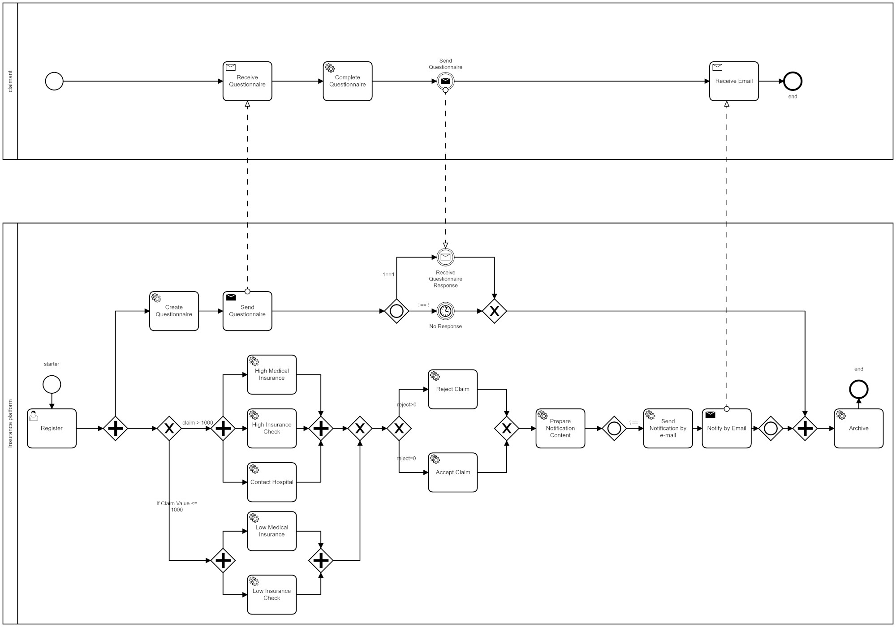

LTCs include:

- LTC1. Before checking the claim, the insurance platform discovers that the claimant has a previous record of insurance fraud. The process needs to be adapted to reject the claim directly.

- LTC2. After accepting the claim, the insurance platform receives a report of insurance fraud. The process needs to be adapted to take an emergent action.

For each LTC, the comparison of adaptation between direct modification and DSL-annotation is:

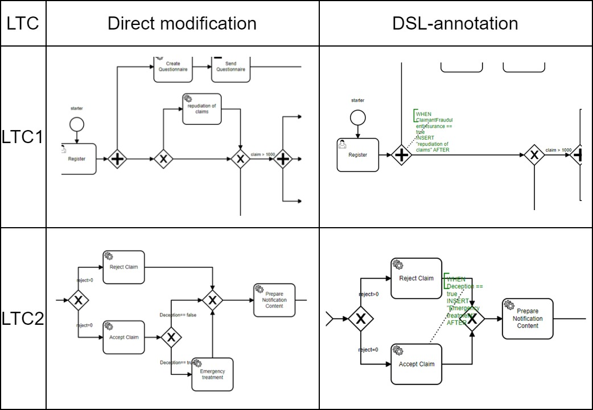

For each LTC, the comparison of time consumption (seconds) between direct modification and DSL-annotation is:

| LTC | Time consumption of direct modification | Time consumption of DSL-annotation |
| ---- | ---- | ---- |
| LTC1 | 128 | 24 |
| LTC2 | 98 | 26 |
| Average | 113.0 | 25.0 |

The overall comparison of time consumption, correctness, and usability rating between direct modification and DSL-annotation is:

| Process adaptation method | Time consumption (seconds) | Correctness | Usability rating (10-point scale) |
| ---- | ---- | ---- | ---- |
| Direct modification | 113.0 | 100.0% | 7.0 |
| DSL-annotation | 25.0 | 100.0% | 10.0 |

## Scenario 4: Paper Review

The business process of an academic conference is:

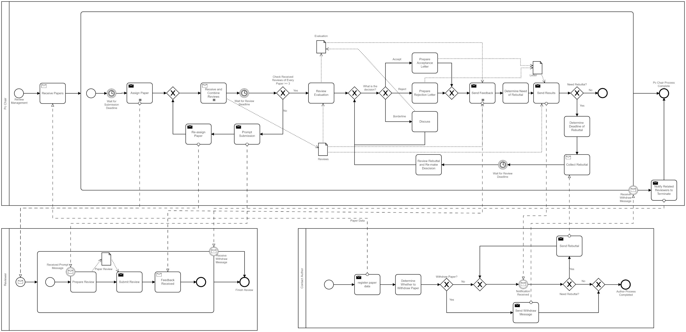

LTCs include:

- LTC1. There are discrepancies in the review results. The PC chair has to convene a meeting to resolve the discrepancies and re-decide the review results.

- LTC2. Some authors are dissatisfied with the review results and make complaints. The PC chair has to give a chance of rebuttal and make final decisions on the review results.

- LTC3. Some reviewers apply for avoidance due to potential conflicts of interest with the authors. The PC chair has to handle the avoidance.

For each LTC, the comparison of adaptation between direct modification and DSL-annotation is:

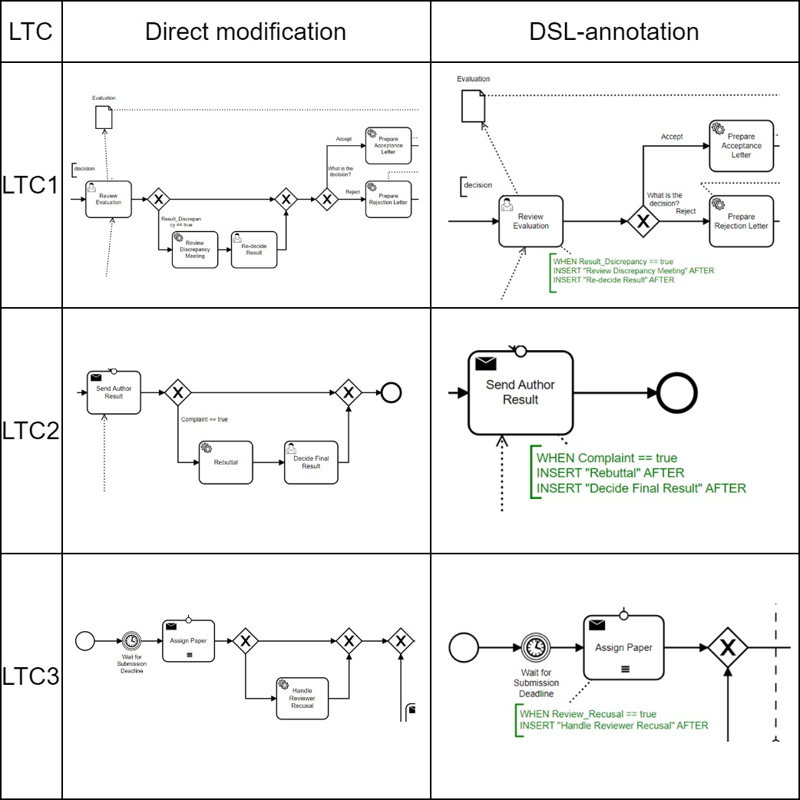

For each LTC, the comparison of time consumption (seconds) between direct modification and DSL-annotation is:

| LTC | Time consumption of direct modification | Time consumption of DSL-annotation |
| ---- | ---- | ---- |
| LTC1 | 290 | 130 |
| LTC2 | 200 | 120 |
| LTC3 | 160 | 90 |
| Average | 216.7 | 113.3 |

The overall comparison of time consumption, correctness, and usability rating between direct modification and DSL-annotation is:

| Process adaptation method | Time consumption (seconds) | Correctness | Usability rating (10-point scale) |
| ---- | ---- | ---- | ---- |
| Direct modification | 216.7 | 66.7% | 7.5 |
| DSL-annotation | 113.3 | 100.0% | 9.0 |

## Scenario 5: Emergency Call

The business process of an emergency call center is:

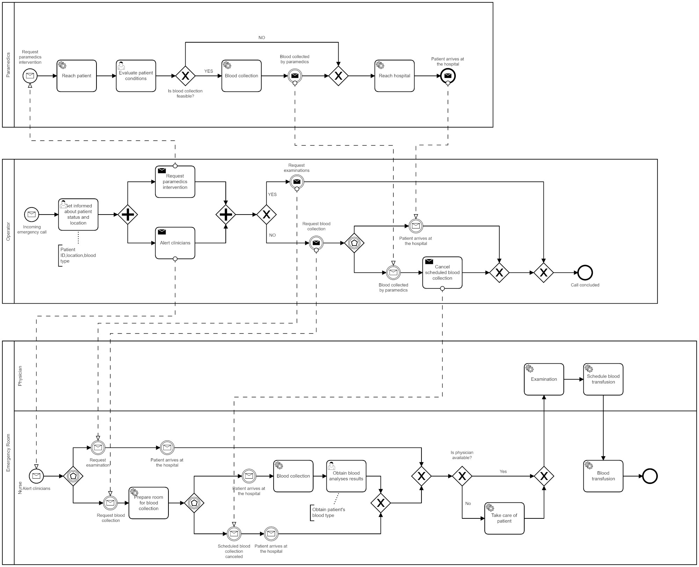

LTCs include:

- LTC1. When paramedics reach the patient, the patient is found unconscious. Paramedics have to give first aid, performing CPR and operating AED.

- LTC2. When preparing a blood transfusion for the patient, paramedics find that the blood storage is insufficient. Paramedics have to make a request to the blood center and obtain the blood storage.

For each LTC, the comparison of adaptation between direct modification and DSL-annotation is:

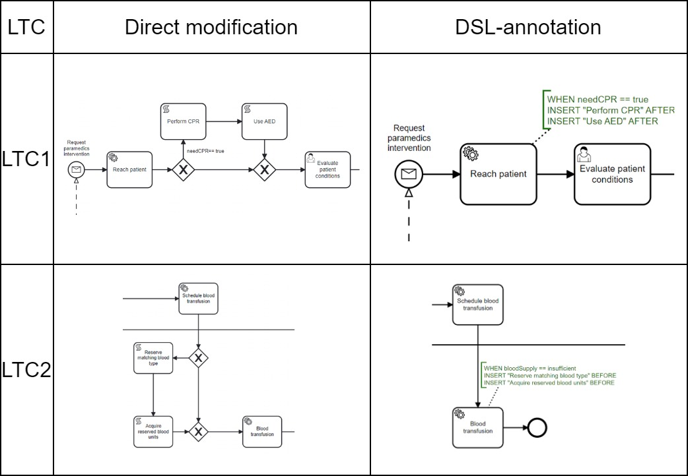

For each LTC, the comparison of time consumption (seconds) between direct modification and DSL-annotation is:

| LTC | Time consumption of direct modification | Time consumption of DSL-annotation |
| ---- | ---- | ---- |
| LTC1 | 83 | 23 |
| LTC2 | 61 | 20 |
| Average | 72.0 | 21.5 |

The overall comparison of time consumption, correctness, and usability rating between direct modification and DSL-annotation is:

| Process adaptation method | Time consumption (seconds) | Correctness | Usability rating (10-point scale) |
| ---- | ---- | ---- | ---- |
| Direct modification | 72.0 | 50.0% | 4.0 |
| DSL-annotation | 21.5 | 100.0% | 9.0 |

## Scenario 6: Outpatient

The business process of a hospital is:

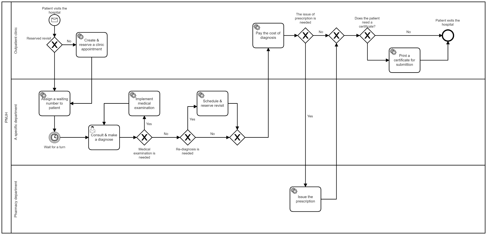

LTCs include:

- LTC1. A patient belonging to a disadvantaged group visits the hospital. The hostipal decides to arrange a special lounge for the patient.

- LTC2. Before paying the cost of diagnosis, the patient decides to use medical insurance.

For each LTC, the comparison of adaptation between direct modification and DSL-annotation is:

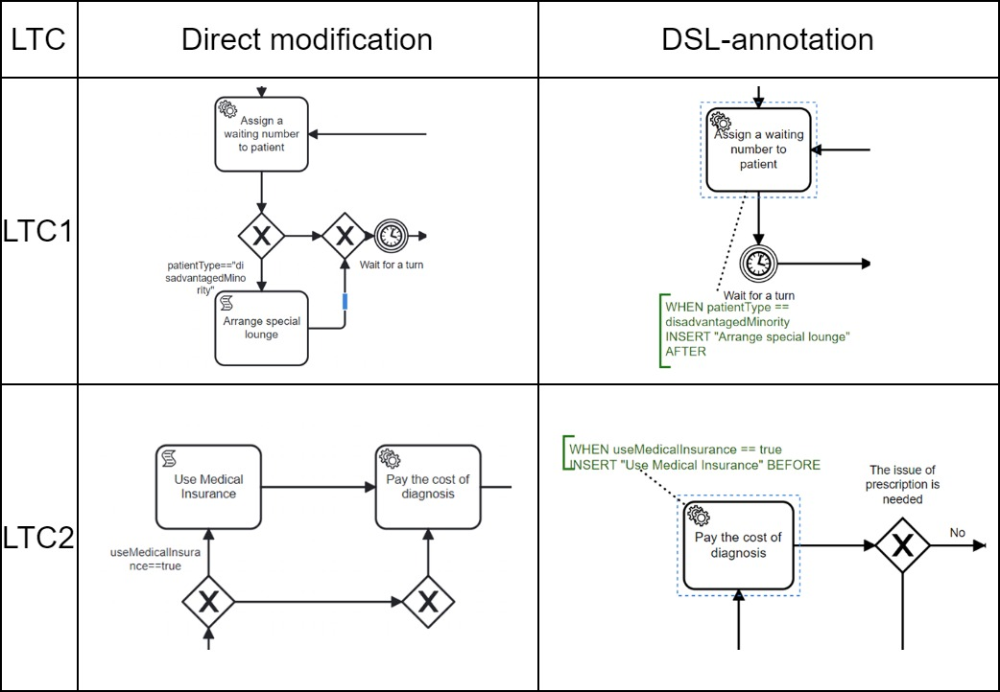

For each LTC, the comparison of time consumption (seconds) between direct modification and DSL-annotation is:

| LTC | Time consumption of direct modification | Time consumption of DSL-annotation |
| ---- | ---- | ---- |
| LTC1 | 64 | 12 |
| LTC2 | 56 | 11 |
| Average | 60.0 | 11.5 |

The overall comparison of time consumption, correctness, and usability rating between direct modification and DSL-annotation is:

| Process adaptation method | Time consumption (seconds) | Correctness | Usability rating (10-point scale) |
| ---- | ---- | ---- | ---- |
| Direct modification | 60.0 | 100.0% | 4.0 |
| DSL-annotation | 11.5 | 100.0% | 9.0 |

## Overall Result

We calculate the weighted average result. Since the LNG Logistics scenario undergoes four times of experiments, it has four times weight.

The overall comparison of time consumption, correctness, and usability rating between direct modification and DSL-annotation is:

| Process adaptation method | Time consumption (seconds) | Correctness | Usability rating (10-point scale) |
| ---- | ---- | ---- | ---- |
| Direct modification | 137.5 | 81.5% | 5.9 |
| DSL-annotation | 54.9 | 96.3% | 9.3 |

