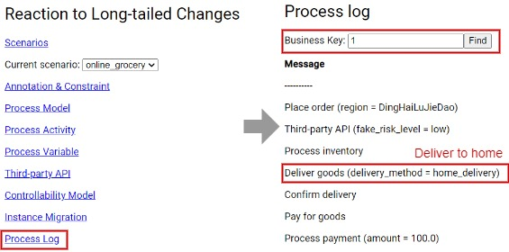
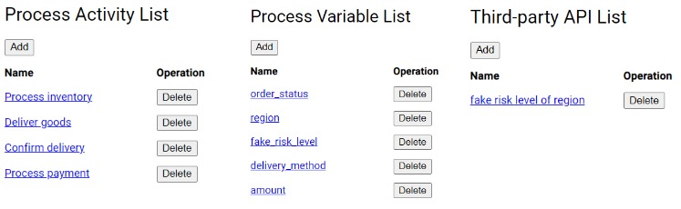
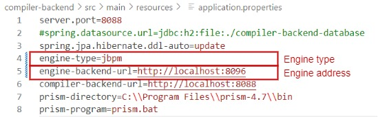

# User Manual for the RESILIENCE System

## Install Running Environment

Install Java 11, Maven 3, Node.js 20, Npm 10.

If functional constraint verification is required, install NuSMV 2.6.0 and add it to PATH.

## Run the RESILIENCE System

Enter the `engine-backend` directory, run the `mvn spring-boot:run` command, and access http://localhost:8082/ through a browser. This is a process engine based on Camunda, with the default user admin/admin:


Enter the `compile-backend` directory and run the `mvn spring-boot:run` command. This is an automated tool for deploying process models and verifying constraints.

Enter the `dsl-frontend` directory. Before the first run, run the `npm install` command to install software packages. Run the `npm run start` command and access http://localhost:8093/ through a browser. This is a tool for adding annotations and constraints to process models to deal with long-tail changes:


`Scenarios` saves business scenarios, with two default scenarios available: `online_groovy` and `lng_statistics`. `Current scenario` is used to switch the current scenario. 

## Add annotations to adjust process behavior

We use online grocery as an example to introduce adding annotations to adjust process behavior. The online grocery decides to adjust delivery method based on the risk level of the customer's region: delivery cannot be made in high-risk regions and orders have to be cancelled; contactless delivery is adopted in medium-risk regions; deliver to home as usual in low-risk regions.

Click `Process Model` and click the `Open` button at `online-grocery-shop.bpmn` to open the online grocery process model:


Select the `Process inventory` activity and click the green annotation button. In the pop-up editor, edit the condition `WHEN fake_risk_level == "high"`, edit the action `SET order_status = "canceled"`, and add an action `ABORT` to abort the process instance. Add another statement, edit the condition `WHEN fake_risk_level == "medium"`, and edit the action `SET delivery_method = "contactless_locker"`. Click the `Complete` button to complete the annotation:


Automatically return to the process model. After selecting the annotation, we can adjust the size:


The adapted process model will be saved in the browser and can be restored by clicking on `Annotation & Constraint` on the homepage next time.

## Deploy Process Models to the Process Engine

Click the `Deploy with annotations` button in the footer, and see `Deployed with annotations` indicating successful deployment:


In order to run the online grocery process, we also need a customer process. Open and deploy the customer process model `online-gross-customer.bpmn` in the same way:


Access http://localhost:8082/. Click `Task list`, click `Start process`, click `Online groovy customer`, fill in the `Business Key` (e.g. `1`), and click `Start` to create a process instance:


When the process instance is executed to the `Confirm goods` activity, the customer needs to complete confirming delivery. Click `Add a simple filter`, click `Confirm goods`, and click `Complete` to confirm delivery:


Come back to http://localhost:8093/. Click `Process Log`, fill in the `Business Key` (e.g. `1`), and click `Find` to view the execution log. We can see that by default, the goods are delivered to home:



When creating a process instance, you can select the customer's region. In this example, there are 12 streets in Yangpu District. Assume the first 4 are low-risk, the middle 4 are medium-risk, and the last 4 are high-risk:


If you select the medium-risk KongJiangLuJieDao when creating a process instance, you can see contactless delivery in the execution log: 


If you select the high-risk DaQiaoJieDao when creating a process instance, you can see the process instance being aborted in the execution log: 


## Specify Functional Constraints

We use online grocery as an example to introduce the specification of functional constraints. The functional constraints of an online grocery include: payment must be fulfilled once goods are delivered.

Add a sequence flow pointing from `Delivery goods` to `Process payment`, select the sequence flow, and select the functional constraint `●--⯈` in the `Functional constraint` field of the property panel, to express that payment must be fulfilled once goods are delivered:


Fill in the name of the process start node (e.g. `Start`) in the first box after `Verify` in the footer, click the `Verify` button to perform the verification, and the displayed `OK` indicates that the verification has passed:


If an incorrect annotation is added, such as canceling the order after delivering goods, resulting in inability to receive payment and violating the functional constraint, the verification will fail:


 
## Specify Non-functional Constraints

We use online grocery as an example to introduce the specification of non-functional constraints. The non-functional constraints of online grocery include: orders must be completed within 120 minutes.

Firstly, set the duration attribute for each activity. For example, select the `Process payment` activity and fill in the non-functional attribute `T:[[0,10]]` in the `SLO/proposal` field of the property panel, to express that the duration (`T:`) is within 10 minutes and is uncontrollable (`[[0,10]]`):


 
Then, specify the total time constraint. Add a sequence flow pointing from `Process inventory` to `Process payment`, select the sequence flow, and fill in the non-functional constraint `T:S[0,120]E` in the `SLO/proposal` field of the property panel, to express that the total time (`T:`) from the beginning of processing inventory (`S`) to the end of processing payment (`E`) must be within 120 minutes (`[0,120]`). To display constraints on the sequence flow, fill in the constraint name in the `Name` field:


Fill in the attribute to be verified and whether the attribute is the smaller the better or the larger the better in the second box after `Verify` in the footer. `T,MIN` represents time, the smaller the better. Click the `Verify` button, and the displayed `OK` indicates that the verification has passed:


 
If we adjust the attributes incorrectly, such as making the duration of the `Process payment` activity too long, reaching 100 minutes, resulting in an excessively long order completion time and violating non-functional constraints, the verification will fail: 


## Set up Activities, Variables, and APIs Available for DSL

The `Process Activity` on the homepage is used to set up the activities that can be chosen from when inserting or replacing activities. `Process Variable` is used to set up the types and value ranges of process variables, that is, the type system. The `Third-party API` is used to set up third-party APIs.




## Switch to the LNG Logistics Scenario to deal with Changes at the Instance Level

Change the `Current scenario` on the homepage to `lng_logistics`, and the system will switch to the LNG logistics scenario:


At this point, clicking the `Process Model` will bring up the LNG logistics emergency response process model. Click the `Open` button to open a process model:


 
The activities, variables, APIs, etc. available for DSL will also switch together.

We use LNG logistics as an example to introduce the changes at the instance level. At first, LNG leaks but does not catch fire. The LNG tanker decides to ventilate and disperse gas. Open `lng-logistics-emergency-instance-1.bpmn` and see that annotations have been added to the process model. Click `Deploy with Annotations` to deploy:


 
Create process instance:


View the process log in the `Process Log` and see that ventilating and dispersing gas activities have been executed. Afterwards, the process instance pauses and waits for a user task, preparing for a change at the instance level:


LNG suddenly catches fire and injures people. The LNG tanker decides to put out fire and rescue the injured. Open `lng-logistics-emergency-instance-2.bpmn` and see that new annotations have been added to the process model. Click `Deploy with Annotations` to deploy:


When the process model changes, it is necessary to migrate instances running on the old version model to the new version model. On the homepage, click `Instance Migration`, fill in the model key in the `Process definition key` (in this example, `Process_1iueza9`), click `Find old instances` to find instances running on the old version model, and click the `Migrate all` button to migrate all instances to the new version model:


Select `LTC2` user task and click `Load Variables` to load process variables:


Check `catch_fire` to simulate a fire situation, click `Complete` to complete the user task and allow the process instance to continue executing:


View the process log in the `Process Log` and see that newly inserted putting out fire and rescuing the injured activities have been executed. Afterwards, the process instance pauses again and waits for a user task, preparing for a change in the instance level:


After a while, the fire becomes uncontrollable, and the LNG tanker decides to change course and eject goods. Open `lng-logistics-emergency-instance-3.bpmn` and see that new annotations have been added to the process model. Click `Deploy with Annotations` to deploy:


 
Migrate instances running on old model to new model:


Complete `LTC3` user task:


 
View the process log in the `Process Log` and see that newly inserted changing course and ejecting goods activities have been executed:


 
`lng-logistics-emergency-constraint.bpmn` is a process model with annotations and constraints. The process model satisfies both functional and non-functional constraints. Because non-functional attributes are resources, before verification, fill in `R,MIN` in the second box after `Verify`, indicating resource, the smaller the better:


 
The functional constraints of LNG logistics include: before putting out fire, people must close doors and block vents to cut off oxygen and control fire area. Opening doors for ventilation before putting out fire will violate functional constraints:


The non-functional constraints of LNG logistics include: the total resource consumption must be less than 50. If the `Eject goods` activity consumes too many resources, resulting in excessive total resource consumption, it will violate non-functional constraints:


## Replace the Process Engine Camunda with Activiti and jBPM

Change the `Current scenario` on the homepage back to `online_groovy`, switching to the online store scenario.

Enter the `engine-activiti` directory and run the `mvn spring-boot:run` command to start the Activiti process engine.

Change the process engine type to `activiti` and the process engine address to `http://localhost:8094`:


Close the running `compiler-backend` project. Enter the `compile-backend` directory, run the `mvn spring-boot:run` command to restart the project.

Open and deploy the `online-grocery-annotation.bpmn` process model, which has annotations to adjust delivery method based on risk level:


Because the process engine does not have a front-end interface, we use an HTTP client such as Postman to request http://localhost:8094/api/deployment/start via POST method to create a process instance with a request body of:

```
{
    "processDefinitionKey": "Process_1nyigqr",
    "businessKey": "1",
    "variables": {
        "region": "KongJiangLuJieDao"
    }
}
```


View the execution log in the terminal running the Activiti process engine. It can be seen that the process engine perceives annotations and adopts contactless delivery in medium risk regions:


Enter the `engine-jbpm` directory, run the `mvn spring-boot:run` command to start the jBPM process engine.

Change the process engine type to `jbpm` and the process engine address to `http://localhost:8096`:


 
Close the running `compiler-backend` project. Enter the `compile-backend` directory, run the `mvn spring-boot:run` command to restart the project.

Open and deploy the `online-grocery-customer-jbpm.bpmn` and `online-grocery-shop-jbpm.bpmn` process models, which are dedicated to jBPM and differ slightly from general process models (e.g. not supporting collaboration diagrams or message flows):


Use an HTTP client such as Postman to request http://localhost:8096/api/deployment/start via POST method to create a process instance with a request body of:

```
{
    "processDefinitionKey": "engine-jbpm.online-grocery-customer-jbpm",
    "businessKey": "1",
    "variables": {
        "region": "KongJiangLuJieDao"
    }
}
```


 
View the execution log in the terminal running the jBPM process engine. It can be seen that the process engine perceives annotations and adopts contactless delivery in medium risk regions:


## Controllability Verification Based on MDP (Prototype)

Install PRISM 4.7 and register the installation directory and program name in the `compile-backend\src\main\resources\application.properties` file:


 
Change the `Current scenario` on the homepage to `online_grocery`. Click `Controllability Model` on the homepage to enter controllability verification. The page is pre-filled with an example of online grocery scenario, including a process model, process variables, and KPI calculation formulas.

Fill in the name of the process start node in the `BPMN start node name`. Fill in the process model BPMN document in the `BPMN model`. Fill in the `BPMN variable definition` for each process variable, including name, type (integer/bool), default value, minimum value, and maximum value. Fill in the `BPMN variable condition` for each sequential flow flowing out from an exclusive gateway. Fill in the `BPMN variable modification` for each activity modifying process variables, including activity ID, variable name, assignment type (determinate/controllable/uncontrollable), determinate value (applicable to determinate), minimum value, and maximum value (applicable to controllable/uncontrollable). Fill in the calculation formula for each KPI in the `BPMN KPI formula`.

Click the `Save` button at the beginning to save. Click the `Build` button to construct the MDP model to be verified and see it in the `Verification model`. Fill in the constraints to be verified in the `Verification property` using the probability LTL formula.

Click the `Verify` button at the beginning to perform the verification, see the verification result in the `Verification Output`, and focus on the `Result` in the last line.
